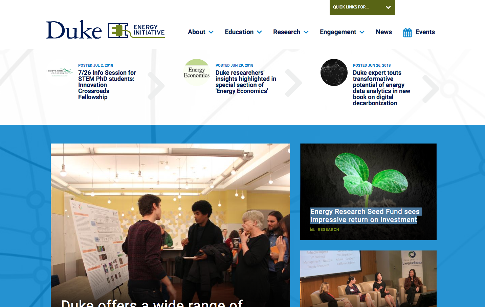
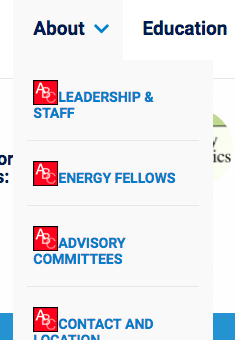
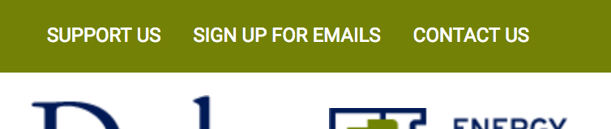
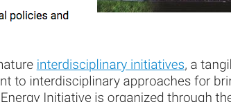
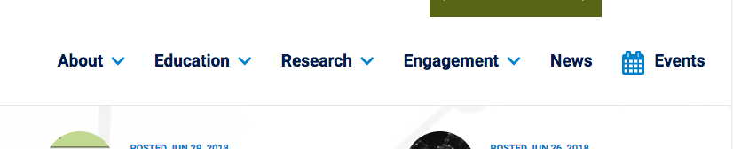
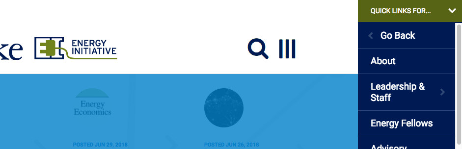

<style>
img { max-width:400px; height: auto;}
img,iframe {border: 1px solid #ccc;}
a { color: blue; }
pre code { font: 9px; }
pre { font: inherit; word-wrap: break-word; background: none; border: none; }
.force-thumbnail { width: 150px; }
.force-thumbnail img { height: auto; }
</style>

# Energy.duke.edu/ Homepage Assessment

__<https://energy.duke.edu/>__

__Screenshot:__

<details>
<summary>Table of Contents</summary>

[TOC]

</details>



# Home Page Accessibility


<br>

## Links do not have a discernible name [priority]

Link text (and alternate text for images, when used as links) that is discernible, unique, and focusable improves the navigation experience for screen reader users. [Learn more](https://dequeuniversity.com/rules/axe/2.2/link-name?application=lighthouse).


### This `<a>` link has no text and its image has no `alt` attribute.

Empty links with no text and an image with no alt text will read _"Link Image"_ to screen reader users. As a result, they will not know what the link does or what is in the image.

__Visual location:__


__HTML location:__

```html
<a href="http://duke.edu"></a>
```

#### Suggested solution:
Add an `alt` attribute to image or add invisible screen reader text.

Add `alt="Go to Duke.edu"` to image.

<details>
<summary>_Additional debugging details_</summary>
Selector:<br>
<code>7,HTML,2,BODY,1,DIV,0,HEADER,1,DIV,0,DIV,0,DIV,0,DIV,0,A</code>

Path:<br>
<code>#duke-logo > a[href&#36;="duke.edu"]</code>

More detailed explanation:<br>
Fix all of the following:
<br>Element is in tab order and does not have accessible text

Fix any of the following:
<br>Element does not have text that is visible to screen readers
<br>aria-label attribute does not exist or is empty
<br>aria-labelledby attribute does not exist, references elements that do not exist or references elements that are empty or not visible
<br>Element&#39;s default semantics were not overridden with role=&#34;presentation&#34;
<br>Element&#39;s default semantics were not overridden with role=&#34;none&#34;
</details>

<hr>

<br>


### This `<a>` link has no text and its image has no `alt` attribute.

Empty links with no text and an image with no alt text will read _"Link Image"_ to screen reader users. As a result, they will not know what the link does or what is in the image.

__Visual location:__


__HTML location:__

```html
<a href="/"></a>
```

#### Suggested solution:
Add an `alt` attribute to image or add invisible screen reader text.

Add `alt="Energy home"` to image.

<details>
<summary>_Additional debugging details_</summary>
Selector:<br>
<code>7,HTML,2,BODY,1,DIV,0,HEADER,1,DIV,0,DIV,0,DIV,1,DIV,0,A</code>

Path:<br>
<code>:root</code>

More detailed explanation:<br>
Fix all of the following:
<br>Element is in tab order and does not have accessible text

Fix any of the following:
<br>Element does not have text that is visible to screen readers
<br>aria-label attribute does not exist or is empty
<br>aria-labelledby attribute does not exist, references elements that do not exist or references elements that are empty or not visible
<br>Element&#39;s default semantics were not overridden with role=&#34;presentation&#34;
<br>Element&#39;s default semantics were not overridden with role=&#34;none&#34;
</details>

<hr>

<br>


### This `<a>` link has no text and its image has no `alt` attribute (x 5).

Empty links with no text and an image with no alt text will read _"Link Image"_ to screen reader users. As a result, they will not know what the link does or what is in the image.

__Visual location:__


__HTML location:__

```html
<a href="http://trinity.duke.edu"></a>
```

```html
<a href="http://www.fuqua.duke.edu"></a>
```

```html
<a href="http://pratt.duke.edu"></a>
```

```html
<a href="https://nicholas.duke.edu"></a>
```

```html
<a href="https://law.duke.edu"></a>
```

```html
<a href="http://sanford.duke.edu"></a>
```


#### Suggested solution:
Add an `alt` attribute with an accurate description to image or add invisible screen reader text.

<details>
<summary>_Additional debugging details_</summary>
Selector:<br>
<code>7,HTML,2,BODY,1,DIV,2,DIV,0,DIV,2,DIV,0,DIV,0,DIV,4,DIV,1,UL,0,LI,0,A</code>

Path:<br>
<code>.duke-logo:nth-child(1) > a[href&#36;="trinity.duke.edu"]</code>

More detailed explanation:<br>
Fix all of the following:
<br>Element is in tab order and does not have accessible text

Fix any of the following:
<br>Element does not have text that is visible to screen readers
<br>aria-label attribute does not exist or is empty
<br>aria-labelledby attribute does not exist, references elements that do not exist or references elements that are empty or not visible
<br>Element&#39;s default semantics were not overridden with role=&#34;presentation&#34;
<br>Element&#39;s default semantics were not overridden with role=&#34;none&#34;
</details>

<br>

<hr>

<br>


### This `<a>` link has no text inside.

There are some social media icons that are not visible. Even though they are not visible, they still throw an error and false positives have been used in litigation to prove accessibility issues, so it will need fixed anyway.

__Visual location:__

Hidden in the green band at the top of the page near the search icon.

__HTML Location__:

```html
<div id="block-block-3" class="block block--block block--block-3">
  <div class="block__content">
    <ul id="top-social">
      <li>
        <a href="https://www.youtube.com/user/DukeUEnergy"></a>
      </li>
      <li>
        <a href="https://twitter.com/dukeuenergy"></a>
      </li>
      <li>
        <a href="https://www.facebook.com/DukeUEnergy"></a>
      </li>
      <li>
        <a href="https://www.linkedin.com/groups?gid=2706359&amp;home="></a>
      </li>
      <li>
        <a href="/duke-energy-initiative.xml"></a>
      </li>
      <li id="desktop_search_callout">
        <a href="#"></a>
      </li>
  </ul>
  </div>
</div>
```
Empty links are not read to a screen reader user, as a result, they will have no idea what the link does or where it would take them.

#### Suggested solution:

Option 1:

It is possible they are missing on purpose. If so, login to the Drupal website and remove Block-3 from the header region. 

Option 2:

If they were accidentally deleted, and they get added back the anchors will need screen reader only text hidden inside them.

```html
<div id="block-block-3" class="block block--block block--block-3">
  <div class="block__content">
    <ul id="top-social">
      <li>
        <a href="https://www.youtube.com/user/DukeUEnergy">
          <span class="element-invisible">Visit us on YouTube</span>
        </a>
      </li>
      <li>
        <a href="https://twitter.com/dukeuenergy">
          <span class="element-invisible">Visit us on Twitter</span>
        </a>
      </li>
      <li>
        <a href="https://www.facebook.com/DukeUEnergy">
          <span class="element-invisible">Visit us on Facebook</span>
        </a>
      </li>
      <li>
        <a href="https://www.linkedin.com/groups?gid=2706359&amp;home=">
          <span class="element-invisible">Visit us on LinkedIn</span>
        </a>
      </li>
      <li>
        <a href="/duke-energy-initiative.xml">
          <span class="element-invisible">Our RSS Feed</span>
        </a>
      </li>
      <li id="desktop_search_callout">
        <a href="#">
          <span class="element-invisible">Search</span>
        </a>
      </li>
    </ul>
  </div>
</div>
```


<details>
<summary>_Additional debugging details_</summary>
Selector:<br>
<code>7,HTML,2,BODY,1,DIV,4,DIV,1,DIV,0,A</code>

Path:<br>
<code>.twitter</code>

More detailed explanation:<br>
Fix all of the following:
<br>Element is in tab order and does not have accessible text

Fix any of the following:
<br>Element does not have text that is visible to screen readers
<br>aria-label attribute does not exist or is empty
<br>aria-labelledby attribute does not exist, references elements that do not exist or references elements that are empty or not visible
<br>Element&#39;s default semantics were not overridden with role=&#34;presentation&#34;
<br>Element&#39;s default semantics were not overridden with role=&#34;none&#34;
</details>


<br>

<hr>

<br>

## Background and foreground colors do not have a sufficient contrast ratio. [priority]

Low-contrast text is difficult or impossible for many users to read. [Learn more](https://dequeuniversity.com/rules/axe/2.2/color-contrast?application=lighthouse).


### Main menu sub-nav background and foreground colors do not have a sufficient contrast ratio.

<mark>This change will be a big win. Changing this one line of code will remove 22 errors from the page.</mark>


Element has insufficient color contrast of [4.01](https://webaim.org/resources/contrastchecker/?fcolor=0680CD&bcolor=f9f9f9) (foreground color: #ffffff, background color: #F9F9F9, font size: 9.0pt, font weight: normal). Expected contrast ratio of [4.5:1](https://webaim.org/resources/contrastchecker/?fcolor=0677BDF&bcolor=f9f9f9)


__Visual location:__



__HTML location:__

```html
<ul id="main-menu" class="main-menu responsive-menu links"><li id="menu-item-886" class="menu-item menu-parent menu-item-primary first">
  ...
  <li id="menu-item-886" class="menu-item menu-parent menu-item-primary first"><a href="/about" title="">About</a>
    <ul class="sub-menu tier-two">
    ...
  </li>
  ...
```

#### Sugested solution:

Change the `color` to the closest possible color of [#0677BD](https://webaim.org/resources/contrastchecker/?fcolor=0677BD&bcolor=FFFFFF) in the generated CSS.

```css
#block-responsive-dropdown-menus-main-menu ul.main-menu li.menu-parent .hovered_item, #block-responsive-dropdown-menus-main-menu ul.main-menu li.menu-parent a {
  display: block;
  min-width: 100%;
  width: 200px;
  padding: 20px;
  line-height: 1.2em;
  text-decoration: none;
  text-transform: uppercase;
-  color: #0680cd;
+  color: #0677BD;
  font-weight: bold;
  font-size: 14px;
}
```

<br>

<hr>

<br>


### The element _"Support Us"_,  _"Sign Up for Emails"_, and _"Contact Us"_ have low contrast.

__Visual location:__




__HTML location:__

```html
<ul class="menu">
  <li class="first leaf"><a href="/support-us" title="">Support Us</a>
  </li>
  <li class="leaf"><a href="/energy-initiative-email" title="">Sign Up for Emails</a></li>
  <li class="last leaf active-trail"><a href="/contact-us" title="" class="active-trail active">Contact Us</a></li>
</ul>
```


#### Suggested solution:

__For :link state__

Element has insufficient color contrast of [4.31](https://webaim.org/resources/contrastchecker/?fcolor=FFFFFF&bcolor=738106) (foreground color: #ffffff, background color: #738106, font size: 9.0pt, font weight: normal). Expected contrast ratio of [4.5:1](https://webaim.org/resources/contrastchecker/?fcolor=FFFFFF&bcolor=707D06)

Change the background color to the closest possible color [#707D06](https://webaim.org/resources/contrastchecker/?fcolor=FFFFFF&bcolor=707D06) in the generated CSS.

```css
.l-branding {
  zoom: 1;
-  background-color: #738106;
+  background-color: #707D06;
  color: #fff;
  line-height: 47px;
  white-space: nowrap;
  text-transform: uppercase;
}
```

__For :hover state__

The hover state is missing. Try changing the existing selectors's color property value (this is the closest possible color to the original color):
  
```css
.l-branding #block-menu-menu-top-nav a:hover {
-  color: #596403
+  color: #0B0D02;
}
```


<details>
<summary>_Additional debugging details_</summary>
Selector:<br>
<code>7,HTML,2,BODY,1,DIV,0,HEADER,0,DIV,0,DIV,0,NAV,0,UL,0,LI,0,A</code>

Path:<br>
<code>a[href&#36;="support-us"]</code>

</details>

<br>

<hr>

<br>

### Most links have no :hover states.

For mouse users, links should have hover states to help indicate that an element can be clicked. This can be accomplished by using `text-decoration`, `border`, having a [contrast ratio](https://webaim.org/resources/contrastchecker/) of 3:1 between the link and its surrounding body text, or other valid method. [Learn more](https://webaim.org/blog/wcag-2-0-and-link-colors/).

Touch screen users (Smart phones, tablets, etc) and keyboard-only users can not hover over text to discover which text is clickable and which is not.

__Visual location:__


#### Suggested solution:

Add `:hover` state of [#067AC3](https://webaim.org/resources/contrastchecker/?fcolor=067AC3&bcolor=FFFFFF) to generated CSS.

```css
.page-home .l-content .panel-1col .panel-col #news .view-display-id-block .view-content .item-list ul li .views-field-created .title a:hover {
 color: #067AC3;
}

```

<br>

<hr>

<br>


### The body link text has low contrast.

Element has insufficient color contrast of [4.21](https://webaim.org/resources/contrastchecker/?fcolor=0680cd&bcolor=FFFFFF) (foreground color: #0680cd, background color: #ffffff, font size: 14.3pt, font weight: normal). Expected contrast ratio of [4.5:1](https://webaim.org/resources/contrastchecker/?fcolor=0680A9&bcolor=FFFFFF).

__Visual location (one example):__



#### Suggested Solution:
Change `color` to closest compliant color of [#0680A9](https://webaim.org/resources/contrastchecker/?fcolor=0680A9&bcolor=FFFFFF):

```css
a, a:visited {
  cursor: pointer;
-  color: #0680cd;
+  color: #0680A9;
}
```

<br>

<hr>

<br>


### The element _"About"_ has low contrast.

__Visual location:__


__HTML location:__

```html
<a class="about-button" href="about">About</a>
```

Element has insufficient color contrast of [4.31](https://webaim.org/resources/contrastchecker/?fcolor=738106&bcolor=FFFFFF) (foreground color: #ffffff, background color: #738106, font size: 9.0pt, font weight: bold). Expected contrast ratio of [4.5:1](https://webaim.org/resources/contrastchecker/?fcolor=707D06&bcolor=FFFFFF).

#### Suggested solution:

Change `background-color` to closest compliant color of [#707D06](https://webaim.org/resources/contrastchecker/?fcolor=707D06&bcolor=FFFFFF).

```css
.page-home .l-content .panel-1col .panel-col .pane-1 .about-button {
  display: inline-block;
  clear: both;
  margin-top: 1em;
  font-size: 9px;
  color: #fff !important;
  padding: 15px 35px;
  font-weight: 700;
  text-decoration: none;
  margin: 40px 0 30px 0;
  text-transform: uppercase;
-  background-color: #707D06;
+  background-color: #0B0D02;
  letter-spacing: 0.38em;
  font-size: 12px;
  padding: 17px 41px;
}
```

<details>
<summary>_Additional debugging details_</summary>
Selector:<br>
<code>7,HTML,2,BODY,1,DIV,2,DIV,0,DIV,2,DIV,0,DIV,0,DIV,3,DIV,2,P,0,A</code>

Path:<br>
<code>.about-button</code>

More detailed explanation:<br>
Fix any of the following:
<br>Element has insufficient color contrast of 4.31 (foreground color: #ffffff, background color: #738106, font size: 9.0pt, font weight: bold). Expected contrast ratio of 4.5:1
</details>

<br>

<hr>

<br>


## Main navigation accessibiity issues

There are a few important issues to fix regarding the menus. I have not had time to create suggested solutions for it yet. It is a complex issue. Not to worry! We will work it out together. Below are a few of the issues:


### Offscreen content is hidden from assistive technology
Offscreen content is hidden from assistive technology

Description:<br>
Offscreen content is hidden with display: none or aria-hidden=true. [Learn more](https://developers.google.com/web/fundamentals/accessibility/how-to-review#try_it_with_a_screen_reader).

At the moment the sub-navigation items are hidden off screen but still in the tab index, making it difficult or impossible for people with disabilities to navigate the web site.

<br>

<hr>

<br>


### `[id]` attributes on the page are not unique

The value of an id attribute must be unique to prevent other instances from being overlooked by assistive technologies. [Learn more](https://dequeuniversity.com/rules/axe/2.2/duplicate-id?application=lighthouse).


### Document has multiple elements with the same id attribute in the main menu and mobile main menu

The module that generates the mobile navigation just dupliates the menu. It results in a few dozen duplicate IDs.  Not to worry! This might have an easy solution.


__Visual location:__



__HTML location:__

```html
<ul id="main-menu" class="main-menu responsive-menu links">
```


### 
  Document has multiple elements with the same id attribute: main-menu in the mobile nav

__Visual location:__



__HTML location:__

```html
<div class="slideRevealMenu doReveal">
    <div>
        <div class="top-bar">
            ...
        </div>
        <div class="ul-wrapper">
            <ul id="main-menu" class="main-menu responsive-menu links" style="left: -198px;">
                <li id="menu-item-886" class="menu-item menu-parent menu-item-primary first mouseover">
                    ...
                </li>
                <li id="menu-item-881" class="menu-item menu-parent menu-item-primary">
                    <a href="/education" title="">Education</a>
                    <ul class="sub-menu tier-two">
                        <li class="collapse-menu"></li>
                            <a>Go Back</a>
                        </li>
                        <li class="landing-page">
                            <a href="/education">Education</a>
                        </li>
                        <li id="menu-item-882" class="menu-item menu-item-secondary first">
                            <a href="/education/programs">Degree Programs</a>
                        </li>
                        <li id="menu-item-885" class="menu-item menu-item-secondary">
                            <a href="/education/courses" title="">Courses</a>
                        </li>
                        <li id="menu-item-883" class="menu-item menu-item-secondary">
                            <a href="/education/bass-connections">Bass Connections</a>
                        </li>
                        <li id="menu-item-906" class="menu-item menu-item-secondary">
                            <a href="/education/extracurricular">Extracurricular</a>
                        </li>
                        <li id="menu-item-884" class="menu-item menu-item-secondary last">
                            <a href="/education/careers">Careers</a>
                        </li>
                    </ul>
                </li>
                <li id="menu-item-891" class="menu-item menu-parent menu-item-primary">
                    ...
                </li>
                <li id="menu-item-877" class="menu-item menu-parent menu-item-primary">
                    ...
                </li>
                <li id="menu-item-533" class="menu-item menu-item-primary">
                    <a href="/news" title="">News</a>
                </li>
                <li id="menu-item-534" class="menu-item menu-item-primary last">
                    <a href="/events" title="">Events</a>
                </li>
            </ul>
        </div>
    </div>
    <div class="social-media-icons">
        ...
    </li>
    </div>
</div>
```

####Suggested solution:

 ```html
 <li id="menu-item-???">
 ```
 
Notice how all the `<li>` have ID attributes.  The module that generates the mobile navigation just dupliates the menu. It results in a few dozen duplicate IDs.

This might be an easy fix.  Advice:

1. Check if the page needs those IDs for CSS for visual reasons.
2. Check if the page needs those IDs for JS for interactive behaviors.
3. If it needs the IDs edit the dependent code, then remove duplicate IDs from the HTML.

If the ID attributes are removed in the main menu, they will be removed in the mobile navigation too. 

<details>
<summary>_Additional debugging details_</summary>
Selector:<br>
<code>7,HTML,2,BODY,1,DIV,0,HEADER,1,DIV,1,DIV,0,DIV,1,DIV,0,UL</code>

Path:<br>
<code>.block__content > div > .main-menu.responsive-menu.links</code>
</details>

<hr>

<br>


## HTML5 landmark elements are used to improve navigation
Manual Test: HTML5 landmark elements are used to improve navigation

Description:<br>
Landmark elements (&lt;main&gt;, &lt;nav&gt;, etc.) are used to improve the keyboard navigation of the page for assistive technology. [Learn more](https://developers.google.com/web/fundamentals/accessibility/how-to-review#take_advantage_of_headings_and_landmarks).

Success.

<br>

<hr>


<br>

## Visual order on the page follows DOM order
Manual Test: Visual order on the page follows DOM order

Description:<br>
DOM order matches the visual order, improving navigation for assistive technology. [Learn more](https://developers.google.com/web/fundamentals/accessibility/how-to-review#try_it_with_a_screen_reader).

[Textise](https://www.textise.net/) is a neat tool for inspecting the natural order [View this website on Textise](https://www.textise.net/showText.aspx?strURL=energy.duke.edu/) of the website. If nothing has been done in JS to interfere the natural tab order, looking at that or viewing the source will basically follow the order of the markup.

Success.

<br>

<hr>


<br>

## Custom controls have associated labels
Custom controls have associated labels

Description:<br>
Custom interactive controls have associated labels, provided by aria-label or aria-labelledby. [Learn more](https://developers.google.com/web/fundamentals/accessibility/how-to-review#try_it_with_a_screen_reader).

Not applicable.

<hr>


<br>

## Custom controls have ARIA roles
Custom controls have ARIA roles

Description:<br>
Custom interactive controls have appropriate ARIA roles. [Learn more](https://developers.google.com/web/fundamentals/accessibility/how-to-review#try_it_with_a_screen_reader).

Not applicable.

<hr>


<br>

## The page has a logical tab order
Manual Test: The page has a logical tab order

Description:<br>
Tabbing through the page follows the visual layout. Users cannot focus elements that are offscreen. [Learn more](https://developers.google.com/web/fundamentals/accessibility/how-to-review#start_with_the_keyboard).

Needs work. This will fix itelf by fixing the "Offscreen content is hidden from assistive technology" issue.

<br>

<hr>

<br>


## The user's focus is directed to new content added to the page
Manual Test: The user&#39;s focus is directed to new content added to the page

Description:<br>
If new content, such as a dialog, is added to the page, the user&#39;s focus is directed to it. [Learn more](https://developers.google.com/web/fundamentals/accessibility/how-to-review#start_with_the_keyboard).

Needs work. This will fix itelf by fixing the "Offscreen content is hidden from assistive technology" issue.

<br>

<hr>

<br>

## User focus is not accidentally trapped in a region
Manual Test: User focus is not accidentally trapped in a region

Description:<br>
A user can tab into and out of any control or region without accidentally trapping their focus. [Learn more](https://developers.google.com/web/fundamentals/accessibility/how-to-review#start_with_the_keyboard).


Success.

<br>

<hr>

<br>


## Site works cross-browser
Site works cross-browser

Description:<br>
To reach the most number of users, sites should work across every major browser. [Learn more](https://developers.google.com/web/progressive-web-apps/checklist#site-works-cross-browser).

Success.

<hr>

<br>


## Interactive controls are keyboard focusable
Manual Test: Interactive controls are keyboard focusable

Description:<br>
Custom interactive controls are keyboard focusable and display a focus indicator. [Learn more](https://developers.google.com/web/fundamentals/accessibility/how-to-review#start_with_the_keyboard).

Needs work. This will fix itelf by fixing the "Offscreen content is hidden from assistive technology" issue.

<br>

<hr>
<hr>

<br>

# Accessibility on Sub-pages

There is enough work to do on the homepage. When issues get fixed on the homepage they will naturally propigate to the subpages. We can come back and review them later.

Adding alt tags is a good content related issue that people could start working on now. Usually that will not require the use of a developer.

## Alt tags missing on all images on the website. 

The best place to start will the the high-traffic top level landing pages.

<https://energy.duke.edu/about>

<https://energy.duke.edu/education>

<https://energy.duke.edu/research>

<https://energy.duke.edu/engagement>

<https://energy.duke.edu/news>

<https://energy.duke.edu/events>

